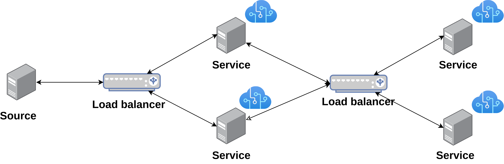

# 🧠 THREE NODE PASID-VALIDATOR

Este projeto simula um sistema distribuído composto por múltiplos serviços e 
dois balanceadores de carga, utilizando Docker e Python. A aplicação envolve o 
envio de mensagens por um componente **source**. As mensagens percorrem dois níveis 
de balanceadores, onde cada balanceador distribui as mensagens por dois serviços.
Cada serviço, por sua vez, processa imagens usando um modelo de IA embarcado. As imagens em
questão são processadas sempre que uma mensagem chega em seu nó, e os resultados do
processamento são armazenados em logs individuais. No último nível, a mensagem 
retorna de volta a origem, onde o **source** registra o tempo médio de resposta.

## 📌 Arquitetura do Sistema



- **SOURCE**: Origem das mensagens (Gatilhos para o processamento das imagens).
- **LOAD BALANCER**: Balanceadores de carga que distribuem as mensagens para os serviços.
- **SERVICES**: Serviços que processam as imagens usando IA sempre que recebem uma mensagem.

## 📁 Estrutura de Pastas do projeto.

```
.
├── docker-compose.yml
├── source/
│   └── source.py # Código do SOURCE 
|   ├── Dockerfile
├── load_balancer/
│   └── load_balancer.py # Código dos balanceadores de carga
│   ├── Dockerfile
├── service/
│   ├── service.py # Código dos serviços que processam as imagens
│   ├── Dockerfile
│   ├── data/ # Imagens para processamento
├── logs/ # Logs individuais de cada host
    ├── source/
    ├── lb1/
    ├── lb2/
    ├── service1/
    ├── service2/
    ├── service3/
    └── service4/
```

## ⚙️ Tecnologias Utilizadas

- Python 3.12
- Docker e Docker Compose
- Sockets TCP
- Tensorflow
- Numpy e Pillow
- MobileNetV2 (IA embarcada nos serviços)
- Balanceamento de carga simples (round-robin)

## 📦 Requisitos

- Docker
- Docker Compose

## 🚀 Como Executar o Projeto

1. Clone o repositório:

```bash
git clone https://github.com/ArmandoLuz/TRABALHO-FINAL-SD.git
cd TRABALHO-FINAL-SD
```

2. Execute o projeto com Docker Compose:

```bash
docker compose up --build
```

3. O sistema iniciará os seguintes containers:

- `source`
- `lb1`
- `lb2`
- `service1`
- `service2`
- `service3`
- `service4`

4. Os logs de cada componente estarão disponíveis nas pastas correspondentes dentro de `logs/`.

## 🔧 Variáveis de Ambiente (exemplo do LB1)
Algumas configurações podem ser ajustadas através de variáveis de ambiente de cada container:

- `LISTEN_HOST=0.0.0.0` # Define o endereço de escuta do LB1.
- `LISTEN_PORT=4000` # Define a porta de escuta do LB1.
- `SERVERS=service1:5000,service2:5001` # Define os serviços que o LB1 irá distribuir as mensagens.
- `LB_ID=1` # Identificador do balanceador de carga (LB-1).

