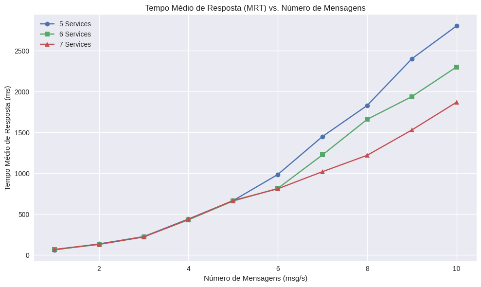
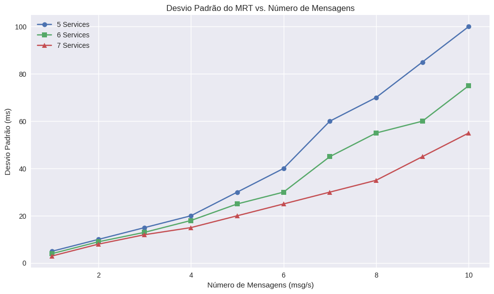

# 🧠 THREE NODE PASID-VALIDATOR

Este projeto simula um sistema distribuído composto por múltiplos serviços e 
dois balanceadores de carga, utilizando Docker e Python. A aplicação envolve o 
envio de mensagens por um componente **source**. As mensagens percorrem dois níveis 
de balanceadores, onde cada balanceador distribui as mensagens por dois serviços.
Cada serviço, por sua vez, processa imagens usando um modelo de IA embarcado. As imagens em
questão são processadas sempre que uma mensagem chega em seu nó, e os resultados do
processamento são armazenados em logs individuais. No último nível, a mensagem 
retorna de volta a origem, onde o **source** registra o tempo médio de resposta.

## 📌 Arquitetura do Sistema


- **SOURCE**: Origem das mensagens (Gatilhos para o processamento das imagens).
- **LOAD BALANCER**: Balanceadores de carga que distribuem as mensagens para os serviços.
- **SERVICES**: Serviços que processam as imagens usando IA sempre que recebem uma mensagem.

## 📁 Estrutura de Pastas do projeto.

```
.
├── docker-compose.yml
├── source/
│   └── source.py # Código do SOURCE 
|   ├── Dockerfile
├── load_balancer/
│   └── load_balancer.py # Código dos balanceadores de carga
│   ├── Dockerfile
├── service/
│   ├── service.py # Código dos serviços que processam as imagens
│   ├── Dockerfile
│   ├── data/ # Imagens para processamento
├── logs/ # Logs individuais de cada host
    ├── source/
    ├── lb1/
    ├── lb2/
    ├── service1/
    ├── service2/
    ├── service3/
    └── service4/
```

## ⚙️ Tecnologias Utilizadas

- Python 3.12
- Docker e Docker Compose
- Sockets TCP
- Tensorflow
- Numpy e Pillow
- MobileNetV2 (IA embarcada nos serviços)
- Balanceamento de carga simples (round-robin)

## 📦 Requisitos

- Docker
- Docker Compose

## 🚀 Como Executar o Projeto

1. Clone o repositório:

```bash
git clone https://github.com/ArmandoLuz/TRABALHO-FINAL-SD.git
cd TRABALHO-FINAL-SD
```

2. Execute o projeto com Docker Compose:

```bash
docker compose up --build
```

3. O sistema iniciará os seguintes containers:

- `source`
- `lb1`
- `lb2`
- `service1`
- `service2`
- `service3`
- `service4`

4. Os logs de cada componente estarão disponíveis nas pastas correspondentes dentro de `logs/`.

## 🔧 Variáveis de Ambiente (exemplo do LB1)
Algumas configurações podem ser ajustadas através de variáveis de ambiente de cada container:

- `LISTEN_HOST=0.0.0.0` # Define o endereço de escuta do LB1.
- `LISTEN_PORT=4000` # Define a porta de escuta do LB1.
- `SERVERS=service1:5000,service2:5001` # Define os serviços que o LB1 irá distribuir as mensagens.
- `LB_ID=1` # Identificador do balanceador de carga (LB-1).

## Resultados de experimentos

Este experimento teve como objetivo avaliar o desempenho de um sistema distribuído sob diferentes níveis de paralelismo, simulando a 
variação do número de serviços responsáveis pelo processamento de mensagens. Para isso, mensurou-se o tempo médio de resposta (MRT) e 
seu desvio padrão (STD) em função da carga, representada pelo número de mensagens processadas por segundo. Três configurações distintas 
foram analisadas, com 5, 6 e 7 serviços ativos e com variadas taxas de geração de mensagens (1 a 10 mensagens por segundo). O MRT reflete a eficiência do sistema, enquanto o STD indica sua estabilidade.





A análise dos gráficos revela um comportamento crescente do tempo médio de resposta (MRT) à medida que o número de mensagens por segundo aumenta, independentemente da quantidade de serviços disponíveis. No entanto, observa-se que o ritmo desse crescimento é fortemente influenciado pelo grau de paralelismo oferecido pelo sistema.

Para o cenário com 5 serviços, o MRT apresenta um crescimento mais acelerado, ultrapassando 2800 ms com 10 mensagens/s, enquanto o mesmo volume de mensagens resulta em 2300 ms com 6 serviços e 1870 ms com 7 serviços. Essa diferença destaca a importância da escalabilidade: o aumento no número de serviços permite distribuir melhor a carga de trabalho, resultando em tempos de resposta menores sob condições de estresse.

Além disso, os gráficos de desvio padrão indicam que a variabilidade do tempo de resposta também é reduzida com mais serviços. Com 5 serviços, os desvios padrão chegam a 100 ms nos piores casos, enquanto com 7 serviços esse valor é significativamente menor (55 ms), evidenciando um sistema mais estável e previsível. A presença de picos de variação mais acentuados em configurações com menos serviços reforça o impacto negativo da saturação prematura.

Outro ponto notável nos gráficos é que, para cargas mais baixas (entre 1 e 5 mensagens/s), os tempos de resposta e suas variações são semelhantes entre os três cenários, indicando que todos operam de forma eficiente quando a carga é reduzida. Contudo, à medida que o número de mensagens aumenta, as diferenças entre as curvas tornam-se mais pronunciadas, e os benefícios da escalabilidade se tornam evidentes tanto em desempenho médio quanto em estabilidade.
Além disso, é válido evidenciar que até 5 mensagens por segundo, é previsível que o sistema opere de forma semelhante nos 3 casos, já que a carga será balanceada entre os 5 hosts na configuração mais fraca. Após esse valor, as diferenças entre os sistsemas se tornam mais evidentes, com o sistema com 7 serviços apresentando uma performance superior, tanto em termos de tempo médio de resposta quanto de estabilidade.

Em resumo, os gráficos deixam claro que a adição de serviços reduz significativamente o tempo de resposta e suaviza a variabilidade do sistema, tornando-o mais robusto e confiável sob cargas crescentes.